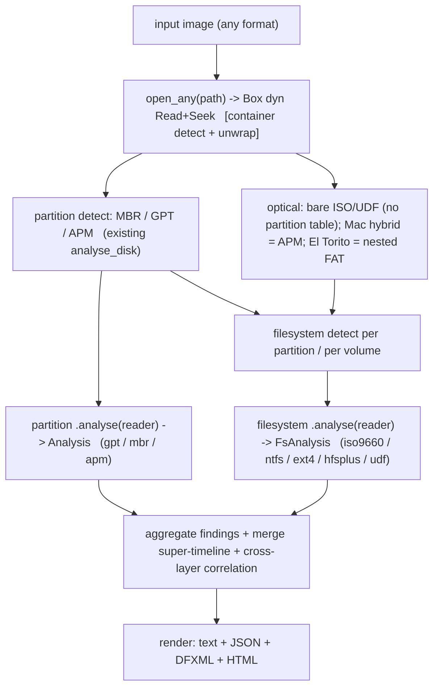

# Plan: grow `disk-forensic` into a full container → partition → filesystem → report pipeline

> Authored 2026-06-06 by the Claude session working on `iso9660-forensic`, for the
> Claude session developing `disk-forensic`. Self-contained; no shared chat context assumed.

## Goal

Today `disk-forensic` is a **partition-scheme** orchestrator: `analyse_disk(reader, size) -> DiskReport`
(MBR / GPT / APM, via `mbr-forensic` / `gpt-forensic` / `apm-forensic` + `forensicnomicon`).
It stops at the partition table — it does **not** open image containers and does **not** descend
into filesystems.

The target is a single entry point that accepts **any** image — `.E01`, `.vmdk`, `.vhdx`, `.vhd`,
`.qcow2`, `.dmg`, `.aff4`, raw `dd`, **and optical `.iso` / `.mds` / `.cue` / `.nrg` / `.ccd` /
`.cdi` / `.toc`** — and emits one **very verbose, examiner-grade forensic report** covering every
layer it can reach.

## Layered architecture (the whole collection already fits this)



Roles already established in `~/src`:
- **Container readers** (`ewf`, `vmdk`, `vhdx`, `vhd`, `qcow2`, `dmg`, `aff4`, `dd`): each exposes
  `std::io::Read + Seek` over the decoded raw image. Uniform; compose freely.
- **Optical container readers** live *inside* `iso9660-forensic` (`open_reader` resolves
  `.cue/.ccd/.nrg/.mds/.cdi/.toc` to the data track). Ask that crate to promote them to a public
  `iso9660_forensic::open(path) -> impl Read+Seek` (tracked on its side).
- **Partition readers** (`mbr/gpt/apm-forensic`): `analyse(reader, …) -> XxxAnalysis { anomalies, … }`.
- **Filesystem readers** (`iso9660/ntfs/ext4fs/hfsplus/udf-forensic`): two surfaces —
  `ForensicFs` (navigation/mount, consumed by `4n6mount`) **and now** `analyse(reader) -> FsAnalysis`
  (batch findings, consumed by *you*).

## The sibling analyzer contract (now real in `iso9660-forensic`)

`iso9660-forensic` just gained the `gpt-forensic`-shaped contract you should consume and that the
other filesystem crates should mirror:

```rust
// iso9660_forensic
pub fn analyse<R: Read + Seek>(reader: &mut R) -> Result<IsoAnalysis, IsoError>;
pub fn analyse_with_options<R: Read + Seek>(reader: &mut R, opts: AnalyseOptions) -> Result<IsoAnalysis, IsoError>;

pub struct IsoAnalysis {
    pub volume: IsoVolumeInfo,     // provenance: tool fingerprints, timestamps, extension flags, sessions
    pub anomalies: Vec<findings::Anomaly>,
}
impl IsoAnalysis { pub fn max_severity(&self) -> Option<Severity>; }

// iso9660_forensic::findings  (mirrors gpt-forensic / mbr-forensic / apm-forensic exactly)
pub enum Severity { Info, Low, Medium, High, Critical }   // Ord
pub enum AnomalyKind { BothEndianMismatch { context, field, byte_offset, le, be }, /* …growing… */ }
pub struct Anomaly { pub severity, pub code: &'static str, pub kind: AnomalyKind, pub note: String }
// serde::Serialize behind the `serde` feature on every type.
```

## Concrete work items (suggested order)

1. **`open_any(path) -> Result<Box<dyn ReadSeek>>`** front-end: detect + unwrap the container by
   magic/extension. E01→`ewf::EwfReader`, VMDK→`vmdk`, VHDX→`vhdx`, VHD→`vhd`, QCOW2→`qcow2`,
   DMG→`dmg`, AFF4→`aff4`, raw→`dd`/`File`; optical (`.iso/.mds/.cue/.nrg/.ccd/.cdi/.toc`)→
   `iso9660_forensic::open`. This is what makes "feed it an E01 or an MDS" real.
2. **Filesystem stage**: after the partition stage (or directly, for bare optical volumes), detect the
   filesystem per partition (reuse `4n6mount`'s `detect::detect_filesystem` if suitable) and call the
   matching crate's `analyse(reader)`. Window each partition with an offset-reader so the fs crate
   sees its own volume starting at 0.
3. **Aggregate report type** that holds: the container/acquisition metadata, the `DiskReport`
   (partitions), and a `Vec` of per-volume `FsAnalysis`, plus a merged **super-timeline**.
4. **Renderers**: verbose text (default), JSON (serde — already the pattern), and ideally **DFXML**
   and an **HTML** report. Lead each section with provenance (observed facts), then anomalies ranked
   by severity.
5. **Cross-layer correlation** (high value): e.g. compare EWF acquisition timestamps against
   filesystem volume/file timestamps; flag a filesystem newer than its acquisition.

## Open decisions (please choose — they affect every crate)

- **Shared finding schema.** Today `Severity`/`Anomaly`/`AnomalyKind` are **copy-pasted** across
  `mbr/gpt/apm-forensic` and now `iso9660-forensic`. For a *uniform* verbose report across 3 partition
  schemes + 6 filesystems + containers, strongly consider extracting a tiny **`forensic-core`** crate
  (or hosting the schema in the existing `forensicnomicon`) defining `Severity`, `Finding`,
  `Evidence`, `TimelineEvent`, `Report`. Otherwise `disk-forensic` must normalize N bespoke
  `XxxAnalysis` types. (Recommendation: shared crate.)
- **Who owns container detection** — `disk-forensic` directly, or a new thin `disk4n6` binary crate
  that composes `open_any` + `disk-forensic` + the filesystem analyzers.

## What a "maximally verbose" report should surface (drives `AnomalyKind` growth)

The engine is **redundancy + slack**: enumerate every redundant copy and diff it; carve every
non-file byte. Distinguish three epistemic layers in the output — **observed fact** → **"consistent
with" inference** → leave conclusions to the examiner (never assert intent). Present a **benign and a
suspicious reading** for each finding (most history is innocent).

Per-layer breadcrumbs to mine (each becomes a `Finding`/`AnomalyKind` in the relevant crate):
- **Provenance / tool fingerprint**: PVD identifier strings + versions, padding/fill signatures,
  system-area contents, container/acquisition metadata (examiner, drive, tool version).
- **Cross-redundancy disagreement** (primary tamper detector): both-endian fields, path-table vs
  directory tree, L vs M path table, primary vs Joliet tree, primary vs backup GPT, multisession PVDs.
- **Temporal**: ISO dir time vs Rock Ridge `TF` (7 POSIX times) vs Joliet; epoch leaks, mixed
  timezones (multiple authoring envs), clustering, future dates → merge into a **super-timeline**.
- **Slack & unused space**: file slack (leaked buffer/RAM), unallocated sectors, **post-`volume_space_size`
  appended payload**, raw-sector **EDC/ECC validity** (genuine dump vs synthesized image).
- **Multisession history**: deleted/replaced files recoverable in earlier sessions; per-session
  burn timeline.
- **Identity intel**: Rock Ridge `PX` uid/gid (authoring account) + inode patterns, `SL` symlink
  targets (leak source machine paths), three-name divergence (ISO/Joliet/`NM`), version suffixes.
- **Boot/executables**: El Torito platform IDs + boot-image hash; embedded PE/ELF (hand off to
  `exec-pe-forensic`).
- **Structural attacks**: overlapping/out-of-bounds extents, path traversal in names, cyclic dirs,
  non-zero reserved fields.

## Conventions (collection-wide)

- **Strict TDD** (separate RED then GREEN commits) and **validate against real data**, not synthetic
  fixtures (generate via `xorriso` / `Aaru` / `hdiutil`, or commit small real images).
- Mirror the existing per-crate `Anomaly { severity, code, kind, note }` schema (derive
  severity/code/note from `kind` so they cannot drift).
- `serde` behind a feature flag on all public output types.

## Status of the `iso9660-forensic` side

**The analyzer data structure is READY to consume — there is NO analysis CLI in
`iso9660-forensic` by design.** That crate is a library returning `IsoAnalysis`; `disk-forensic`
(disk4n6) owns the CLI and renders the report. Consume the typed struct directly:

```rust
let analysis: iso9660_forensic::IsoAnalysis = iso9660_forensic::analyse(&mut reader)?;
// IsoAnalysis { volume: IsoVolumeInfo, anomalies: Vec<findings::Anomaly> } + .max_severity()
// IsoVolumeInfo: volume_label, system_id, volume_set_id, publisher_id,
//   data_preparer_id (mastering-tool fingerprint), application_id, creation_time,
//   modification_time, sector_mode, session_count, has_rock_ridge, has_joliet,
//   has_enhanced_volume_descriptor.
// Anomaly { severity: Severity{Info,Low,Medium,High,Critical}, code: &'static str,
//           kind: AnomalyKind, note: String }  -- group by severity, dedupe by code.
// All public; every type derives serde::Serialize behind the `serde` feature
// (Serialize only -- you hold the struct from analyse(), no round-trip needed).
```

- DONE: `analyse()` shipped on `main` with **23 finding codes**, each deriving severity/code/note
  from its `kind` (same model as gpt/mbr/apm-forensic) so your renderer treats every layer's
  findings uniformly. Group by severity, dedupe by code:
  - **Cross-redundancy (tamper):** ISO-BOTH-ENDIAN (High), ISO-PATHTABLE-ENDIAN (High, L↔M table),
    ISO-PATHTABLE-DIVERGENCE (Medium phantom / High ghost, table↔tree), ISO-TREE-DIVERGENCE (High,
    primary↔Joliet).
  - **Slack & appended:** ISO-SLACK-DATA (Low), ISO-TRAILING-DATA (Medium), ISO-PRESYS-DATA
    (Low/Medium), ISO-RESERVED-DATA (Low, non-zero PVD reserved fields).
  - **Structural:** ISO-OOB-EXTENT (High), ISO-OVERLAP-EXTENT (High), ISO-DIR-CYCLE (High),
    ISO-ORPHAN-FILE (Medium), ISO-SYMLINK (Low absolute / High traversal).
  - **Temporal:** ISO-TIME-AFTER-VOL (Medium), ISO-MIXED-TZ (Low), ISO-TIME-IMPLAUSIBLE (Medium,
    < 1985 or > 2100).
  - **History:** ISO-SUPERSEDED-FILE (Medium, recoverable deleted/replaced content across sessions).
  - **Concealment / authenticity:** ISO-NAME-DIVERGENCE (High, Rock Ridge vs Joliet long name
    disagree for the same file — OS-specific filename concealment), ISO-DISGUISED-EXEC (High, a
    document/media-extension file whose content is a PE/ELF/Mach-O executable — hand the executable
    itself to a PE/ELF analyzer), ISO-EDC-INVALID / ISO-ECC-INVALID (Medium, raw 2352 Mode-1 sectors
    with invalid/zero EDC or Reed-Solomon P/Q ECC — a synthesized/repackaged image rather than a
    faithful drive dump, or tampered data; ECC additionally catches tampering where EDC was
    recomputed but ECC was not).
  - **Temporal (per-file):** ISO-TIME-MISMATCH (Medium, ISO directory recorded time vs Rock Ridge TF
    modify time disagree — an edited stamp).
  - **Authoring oddity:** ISO-FILE-VERSION (Low, a name version suffix other than ;1).
  - Bonus public helpers: `iso9660_forensic::sector::cd_edc(&[u8]) -> u32` and
    `mode1_ecc_valid(&[u8]) -> bool` / `cd_ecc_stamp(&mut [u8])` (CD-ROM Mode-1 EDC + Reed-Solomon
    P/Q ECC) for verifying dump authenticity directly.
- DONE: `IsoVolumeInfo` provenance now also carries `boot_entries: Vec<BootRecord { platform,
  bootable, load_lba, sectors, sha256 }>` (El Torito — BIOS/UEFI boot capability, boot-image LBA,
  and the boot image's SHA-256 for matching known-malicious images), `rock_ridge_uids` /
  `rock_ridge_gids` / `rock_ridge_inodes` (PX authoring-account + inode identity), and
  `earliest_file_time` / `latest_file_time` (the authoring-time window — feed these into your
  super-timeline). `BootRecord` is re-exported from the crate root.
- DONE: `analyse()` and `IsoReader::walk()` are crash-resistant on corrupt/truncated images —
  out-of-bounds extents (file *and* directory) and directory cycles are surveyed and reported as
  findings rather than erroring out (EOF-tolerant audits + cycle-safe traversal).
- DONE: `iso9660_forensic::open(path) -> Result<Box<dyn ReadSeek>, IsoError>` is now public — it
  resolves a raw `.iso` or a `.cue`/`.ccd`/`.nrg`/`.mds`/`.toc` container to a `Read + Seek` over the
  ISO 9660 data track. Wire it straight into your `open_any` for the optical branch; the returned
  `Box<dyn ReadSeek>` already implements `Read + Seek`, so feed it to `analyse(&mut src)` or
  `IsoReader::open(src)` directly. `ReadSeek` is also re-exported if you want the trait.
- NOTE: the standalone `iso9660-cli` binary has been **removed** — `iso9660-forensic` is now
  library-only and `disk4n6` is the single CLI for the whole collection. Nothing was lost; the only
  library-worthy capability (container resolution) is the `open()` above.
- Boundary: `iso9660-forensic` reads **ISO 9660 + optical layers only**; UDF/HFS+/APM are their own
  sibling crates you compose, each exposing (or to expose) the same `analyse()->Analysis` shape.
