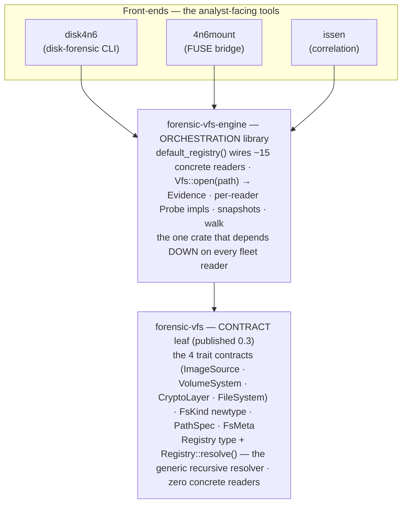

# Architecture — Universal Forensic VFS

The fleet's universal forensic VFS is a single open-any-image entry point shared by `issen`, `4n6mount`, and `disk4n6`, rather than three parallel detection and dispatch stacks. The contract leaf — [`forensic-vfs`](https://crates.io/crates/forensic-vfs) — is published (0.3), carrying the four trait contracts plus `Registry::resolve`; the reader-wiring lives in `forensic-vfs-engine`. The full specification is in [`docs/design/2026-07-06-universal-forensic-vfs.md`](design/2026-07-06-universal-forensic-vfs.md). See [The four components and how they relate](#the-four-components-and-how-they-relate) for the crate-by-crate breakdown.

## The layered model

Six transform kinds, each a trait in `forensic-vfs`, compose as a graph. Every transform consumes an `ImageSource` and yields either another `ImageSource` or a terminal `FileSystem`. The resolver applies them in whatever order the evidence requires — crypto may appear before or after volume detection:

```
PathSpec (locator, self-describing, serde-safe)
   │ resolves (graph walk)
   ▼
ImageSource  ── positioned read_at(&self), no write, no seek cursor ──────┐
   ├── ContainerDecoder  E01 / VMDK / VHDX / QCOW2 / DMG / AFF4 / AD1    │
   ├── VolumeSystem      MBR / GPT / APM / VSS / APFS-container           │
   ├── CryptoLayer       BitLocker / LUKS / FileVault                      │
   └── FileSystem        NTFS / ext4 / HFS+ / APFS / ISO / FAT → FsNode  ─┘
```

Real nesting orders the graph must handle, and that a fixed-lane model cannot: `E01 → GPT → BitLocker → NTFS`, `raw → LUKS → LVM → ext4`, `E01 → APFS-container(encrypted volume) → APFS`.

## Core types

### `ImageSource`

The universal edge: a read-only, randomly-addressable byte stream. Positioned reads (`read_at(&self, offset, buf)`) carry no cursor, so one source is shared across threads by `&self`. There is no write method anywhere in this trait or its impls — evidence is read-only by construction, not by convention.

Concrete implementations: a decoded E01 segment set, a partition sub-range, a decrypted BitLocker volume, a VSS store, a file's data stream. All compose without any lock on the hot path.

### `PathSpec`

A self-describing, recursive locator that carries the full open-recipe for an artifact. It round-trips through a report, session, or evidence row via serde, without embedding credentials. Credentials are supplied at resolve time through an injected `CredentialSource`, so a serialized `PathSpec` is safe to log and replay without leaking keys.

### `FsMeta`

Per-node forensic metadata: timestamps (with `TimeResolution` preserving NTFS 100 ns granularity and FAT local-time ambiguity), `allocated`/`deleted` status at the name, metadata, and content allocation layers (the TSK three-layer model), named data streams, `xattr`s, slack, and per-field provenance.

## The four components and how they relate

The stack is four crates in three tiers. The dependency arrow points **up**: contracts at the bottom know nothing about the readers or front-ends above them; the front-ends at the top share one engine instead of each carrying its own detection stack.



| Crate | Tier | What it is | Depends on |
|---|---|---|---|
| **`forensic-vfs`** | CONTRACT (leaf, published 0.3) | The *abstraction*: the four VFS trait contracts (`ImageSource`, `VolumeSystem`, `CryptoLayer`, `FileSystem`), the `FsKind` identity newtype (re-exported from `forensicnomicon-core`), `PathSpec`, `FsMeta`, `VfsError`, bounds-checked read helpers, and the `Registry` type **plus `Registry::resolve()` — the generic recursive resolver** (sniff head/tail → match a probe → descend container→volume→filesystem). It carries **zero concrete readers**. Base deps: `thiserror` + `forensicnomicon-core`; optional `serde` / `findings` / `history`. | nothing but leaves |
| **`forensic-vfs-engine`** | ORCHESTRATION (its own crate) | The *wiring that makes the abstraction concrete*: `default_registry()` populates a `Registry` with the ~15 fleet readers (ewf · vhd · vhdx · qcow2 · vmdk · dmg · aff4 containers; mbr · gpt · apm volumes; ntfs · ext4 · apfs · hfsplus · xfs · iso9660 · fat filesystems), each behind a per-reader `Probe`; exposes `Vfs::open(path) → Evidence` (open the base source, then `Registry::resolve`), plus snapshots and `walk`. **This is the one crate that depends *down* on every reader** — which is exactly why it is its own crate and not part of the `forensic-vfs` contract repo. | `forensic-vfs` + every reader |
| **`disk-forensic` / `disk4n6`** | FRONT-END (CLI) | The analyst-facing disk tool: it owns container decode + MBR/GPT/APM volume parsing + ISO filesystem analysis + live-triage + acquisition-integrity findings, and renders reports (text / JSON / DFXML / HTML). For the *general* open-any-image walk it consumes the engine. | `forensic-vfs-engine` |
| **`4n6mount`** | FRONT-END (FUSE) | The FUSE bridge — calls `forensic_vfs_engine::open(path)` and exposes the resolved `dyn FileSystem` as a normal read-only directory (`ls`/`grep`/`cat`). A *thin* adapter: it forwards per-filesystem Cargo features to the engine and adds no detection logic of its own. | `forensic-vfs-engine` |

**The one-line mental model:** `forensic-vfs` is the *contract + resolver*, `forensic-vfs-engine` is the *contract made concrete by wiring in every reader*, and `disk4n6` / `4n6mount` / `issen` are *thin front-ends that share that one engine* instead of maintaining three parallel detect-and-dispatch stacks.

Why the engine is separate from `forensic-vfs` (not a member of its workspace): a crate that depends on all 15 concrete readers is an ORCHESTRATION concern. Putting it inside the contract repo would invert the layering (contracts depending on every implementation) and make the contract repo un-buildable in CI without every sibling checked out. So the generic resolver lives in `forensic-vfs` (`Registry::resolve`), and only the reader-wiring lives in `forensic-vfs-engine`.

## Development status

| Phase | Scope | Status |
|---|---|---|
| — | Container decode (E01/VMDK/VHDX/VHD/QCOW2/DMG/raw/ISO), MBR/GPT/APM parsing, live triage (macOS/Linux/Windows), ISO filesystem analysis, acquisition-integrity findings | ✅ Shipped |
| 1 | Extract the `forensic-vfs` leaf: the four trait contracts + `FsKind` newtype + `PathSpec` + `FsMeta` + adapters, plus `Registry` and the generic recursive `Registry::resolve`. | ✅ Shipped (`forensic-vfs` 0.3, published) |
| 2 | `forensic-vfs-engine`: `default_registry()` wiring the concrete readers + per-reader `Probe` impls + `Vfs::open(path)`; per-partition filesystem mounting. | 🔶 In progress — the engine crate exists; being relocated to its own repo out of the `forensic-vfs` workspace |
| 3 | One issen provider replaces the per-format wrapper crates (ADR-0010). | Planned |
| 4 | `4n6mount` migrates onto the engine, dropping its own detect/dispatch. | Planned |
| 5 | Crypto + snapshots + nesting: `CryptoLayer` (BitLocker/LUKS/FileVault), VSS `VolumeSystem`, nested images, `TemporalCohort` snapshots. | 🔶 Partial — reader crates exist (bitlocker/luks/filevault/veracrypt, VSS); engine wiring pending |
| 6 | In-tree trait impls per reader crate; shims deleted. | 🔶 In progress — readers carry `vfs` adapters (most migrated to `forensic-vfs` 0.3); zfs/ufs/refs `FileSystem` adapters deferred on reader gaps |

Fleet-wide `FsKind` consistency and the reader migration onto `forensic-vfs` 0.3 have largely landed; the wiring audit in the [umbrella validation inventory](validation-inventory.md#vfs-contract-wiring-status) tracks which adapters are merged to `main` versus still on a branch. Each phase is gated on the Case-001 Szechuan end-to-end ingest producing identical event counts and artifacts to the pre-phase baseline — no silent regressions.

## Key design decisions

**`read_at(&self)` not `read(&mut self, Seek)`.** A positioned read with `&self` composes across threads without a lock. `Seek`'s `&mut self` cursor cannot — issen's parallel ingest would need one handle per worker. The trade-off: `Read + Seek` adapters (for the existing fleet readers that expose only a cursor) use a pool of cursors, one per thread, checked out on demand.

**No write path anywhere.** A write is uncompilable, not undocumented. dfVFS and TSK are read-only by discipline; here it is a type property.

**Compiled-in registry, not `inventory`.** The probe table is a `Vec<Box<dyn Probe>>` initialized once by `default_registry()`; `inventory`/`linkme` introduce linker-section coupling and are harder to test in isolation. Per-reader Cargo features (`default = ["all-readers"]`) keep Cargo feature-unification from silently reshaping the graph.

**`forensic-vfs` is a true leaf.** The `findings` and `history` bridges (`forensicnomicon::report` and `state-history-forensic`) are non-default features. A filesystem reader implements the base traits with neither enabled; the engine turns both on. No reader inherits report/serde/json choices it did not ask for, and no dependency cycle is possible.

**Credentials out of band.** A `PathSpec` is a pure address — safe to serialize and log. Credentials (passwords, recovery keys, keyfiles) are supplied at resolve time through an injected `CredentialSource` trait object. dfVFS stores them in a global keychain; this design keeps credentials out of the serialized address entirely.
