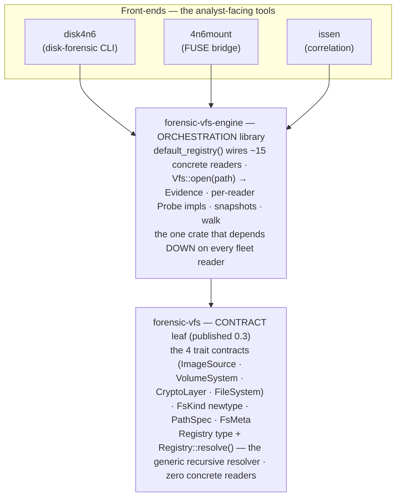

# Architecture — disk-forensic (a VFS consumer)

`disk-forensic` / `disk4n6` is a **front-end consumer** of the fleet's universal
forensic VFS: one open-any-image entry point shared by `issen`, `4n6mount`, and
`disk4n6`, rather than three parallel detection and dispatch stacks. It owns the
analyst-facing disk tool and its report rendering; the general open-any-image
detection and navigation come from the shared engine.

The VFS **contract, its core types (`ImageSource` / `PathSpec` / `FsMeta`), and the
design decisions** behind them live in
[forensic-vfs](https://github.com/SecurityRonin/forensic-vfs) — its
[README](https://github.com/SecurityRonin/forensic-vfs#readme),
[`docs/decisions/` ADRs](https://github.com/SecurityRonin/forensic-vfs/tree/main/docs/decisions),
and [PRD](https://github.com/SecurityRonin/forensic-vfs/blob/main/docs/PRD.md) are
the source of truth. This page documents disk-forensic's own role and how the four
crates relate.

## What disk-forensic owns

`disk-forensic` / `disk4n6` is the analyst-facing disk tool. Its own
responsibilities — the work that is *not* delegated to the shared engine:

- **Container decode** — E01/VMDK/VHDX/VHD/QCOW2/DMG/raw/ISO.
- **Volume-system parsing** — MBR / GPT / APM partition tables.
- **ISO filesystem analysis**.
- **Live triage** — macOS / Linux / Windows.
- **Acquisition-integrity findings**.
- **Report rendering** — text / JSON / DFXML / HTML.

For the *general* open-any-image walk it consumes `forensic-vfs-engine`.

## The four components and how they relate

The stack is four crates in three tiers. The dependency arrow points **up**:
contracts at the bottom know nothing about the readers or front-ends above them;
the front-ends at the top share one engine instead of each carrying its own
detection stack.

| Crate | Tier | What it is | Depends on |
|---|---|---|---|
| **`forensic-vfs`** | CONTRACT (leaf, published 0.3) | The *abstraction*: the four VFS trait contracts (`ImageSource`, `VolumeSystem`, `CryptoLayer`, `FileSystem`), the `FsKind` identity newtype (re-exported from `forensicnomicon-core`), `PathSpec`, `FsMeta`, `VfsError`, bounds-checked read helpers, and the `Registry` type **plus `Registry::resolve()` — the generic recursive resolver** (sniff head/tail → match a probe → descend container→volume→filesystem). It carries **zero concrete readers**. | nothing but leaves |
| **`forensic-vfs-engine`** | ORCHESTRATION (its own crate) | The *wiring that makes the abstraction concrete*: `default_registry()` populates a `Registry` with the ~15 fleet readers (ewf · vhd · vhdx · qcow2 · vmdk · dmg · aff4 containers; mbr · gpt · apm volumes; ntfs · ext4 · apfs · hfsplus · xfs · iso9660 · fat filesystems), each behind a per-reader `Probe`; exposes `Vfs::open(path) → Evidence` (open the base source, then `Registry::resolve`), plus snapshots and `walk`. **This is the one crate that depends *down* on every reader.** | `forensic-vfs` + every reader |
| **`disk-forensic` / `disk4n6`** | FRONT-END (CLI) | The analyst-facing disk tool: container decode + MBR/GPT/APM volume parsing + ISO filesystem analysis + live-triage + acquisition-integrity findings, rendering reports (text / JSON / DFXML / HTML). For the *general* open-any-image walk it consumes the engine. | `forensic-vfs-engine` |
| **`4n6mount`** | FRONT-END (FUSE) | The FUSE bridge — calls `forensic_vfs_engine::open(path)` and exposes the resolved `dyn FileSystem` as a normal read-only directory (`ls`/`grep`/`cat`). A *thin* adapter: it forwards per-filesystem Cargo features to the engine and adds no detection logic of its own. | `forensic-vfs-engine` |

**The one-line mental model:** `forensic-vfs` is the *contract + resolver*,
`forensic-vfs-engine` is the *contract made concrete by wiring in every reader*,
and `disk4n6` / `4n6mount` / `issen` are *thin front-ends that share that one
engine* instead of maintaining three parallel detect-and-dispatch stacks.

Why the engine is separate from `forensic-vfs` (not a member of its workspace): a
crate that depends on all 15 concrete readers is an ORCHESTRATION concern. Putting
it inside the contract repo would invert the layering (contracts depending on
every implementation) and make the contract repo un-buildable in CI without every
sibling checked out. So the generic resolver lives in `forensic-vfs`
(`Registry::resolve`), and only the reader-wiring lives in `forensic-vfs-engine`.

## The VFS contract lives in forensic-vfs

The byte-source trait (`ImageSource`), the recursive `PathSpec` locator, the
forensic metadata record (`FsMeta`), the layered transform model, the error model,
and every design decision (positioned-read-not-seek, no-write-path, credentials
out-of-band, compiled-in registry, true-leaf feature gating) are documented once,
in [forensic-vfs](https://github.com/SecurityRonin/forensic-vfs) — its README,
`docs/decisions/` ADRs, and PRD are the source of truth. The origin design doc's
prior-art survey and adversarial review log are preserved there under
[`docs/design-history.md`](https://github.com/SecurityRonin/forensic-vfs/blob/main/docs/design-history.md).

## Development status

| Phase | Scope | Status |
|---|---|---|
| — | Container decode (E01/VMDK/VHDX/VHD/QCOW2/DMG/raw/ISO), MBR/GPT/APM parsing, live triage (macOS/Linux/Windows), ISO filesystem analysis, acquisition-integrity findings | ✅ Shipped |
| 1 | Extract the `forensic-vfs` leaf: the four trait contracts + `FsKind` newtype + `PathSpec` + `FsMeta` + adapters, plus `Registry` and the generic recursive `Registry::resolve`. | ✅ Shipped (`forensic-vfs` 0.3, published) |
| 2 | `forensic-vfs-engine`: `default_registry()` wiring the concrete readers + per-reader `Probe` impls + `Vfs::open(path)`; per-partition filesystem mounting. | ✅ Shipped — a separate published repo (`forensic-vfs-engine` 0.1.0); the engine repoint onto the 0.4 leaf lands in the 0.4 fleet cut |
| 3 | One issen provider replaces the per-format wrapper crates (ADR-0010). | Planned |
| 4 | `4n6mount` migrates onto the engine, dropping its own detect/dispatch. | Planned |
| 5 | Crypto + snapshots + nesting: `CryptoLayer` (BitLocker/LUKS/FileVault), VSS `VolumeSystem`, nested images, `TemporalCohort` snapshots. | 🔶 Partial — reader crates exist (bitlocker/luks/filevault/veracrypt, VSS); engine wiring pending |
| 6 | In-tree trait impls per reader crate; shims deleted. | 🔶 In progress — readers carry `vfs` adapters (most migrated to `forensic-vfs` 0.3); zfs/ufs/refs `FileSystem` adapters deferred on reader gaps |

Fleet-wide `FsKind` consistency and the reader migration onto `forensic-vfs` 0.3
have largely landed; the wiring audit in the
[umbrella validation inventory](validation-inventory.md#vfs-contract-wiring-status)
tracks which adapters are merged to `main` versus still on a branch. Each phase is
gated on the Case-001 Szechuan end-to-end ingest producing identical event counts
and artifacts to the pre-phase baseline — no silent regressions.
