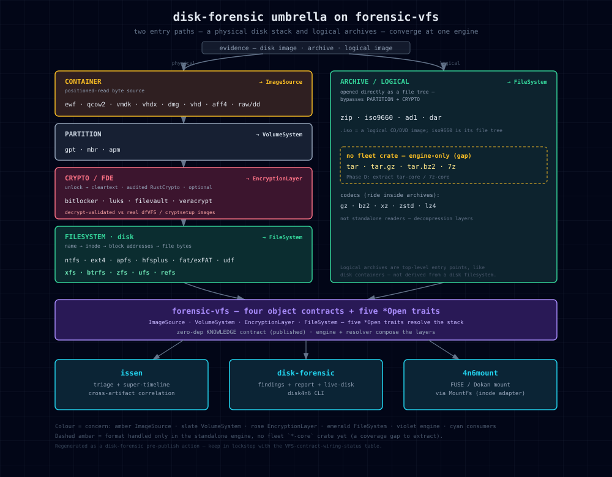

# Disk-Forensic Umbrella — Test-Fixture & Validation Inventory

A single index of test-data provenance and validation across every reader under the
disk-forensic umbrella — containers, partition schemes, filesystems, and full-disk
encryption. Each row links out to that repo's own `docs/validation.md` (the
correctness evidence) and `tests/data/README.md` (per-fixture provenance). This page
does not duplicate those; it is the map.

## Architecture

Evidence enters by one of **two parallel paths** that converge at the engine:
a **physical disk stack** (container → partition → optional full-disk encryption →
filesystem) and a **logical-archive path** (`.zip`/`.iso`/`.ad1`/`.dar`/`.tar`/`.7z`
opened directly as a file tree, bypassing partition + crypto). Both resolve to the
same four forensic-vfs contracts, which the `issen`, `disk-forensic`, and `4n6mount`
consumers navigate. Every reader ships a `-core` reader plus a `-forensic` graded
auditor; the tables below index each one's validation.



## VFS contract wiring status

Every reader plugs into forensic-vfs behind an optional `vfs` feature. This is the
audit of that wiring at last regeneration (a pre-publish action — see Maintenance):

| Contract | ✅ merged to `main` | 🔶 built, on feature branch (merge + publish) | ❌ adapter missing |
|---|---|---|---|
| **ImageSource** (container) | qcow2, vhdx | ewf, vhd, aff4 | **vmdk, dmg** |
| **VolumeSystem** (partition) | — | gpt, mbr, apm | — |
| **CryptoLayer** (FDE) | veracrypt (0.2.1) | bitlocker, luks, filevault | — |
| **FileSystem** · disk | ntfs, fat, udf, iso9660*, **xfs (0.1.1)**, btrfs | ext4fs, apfs, hfsplus, iso9660 | **zfs, ufs, refs** |
| **FileSystem** · archive/logical | zip, ad1, dar | — | **tar, tar.gz, tar.bz2, 7z** — no fleet crate (engine-only) |

*iso9660 has both a merged path and a `feat/vfs-iso` branch; treat the branch as the source of truth until merged.

**Formats handled *outside* a fleet crate.** `tar` / `tar.gz` / `tar.bz2` / `7z` are
implemented only inside the standalone engine (old `ForensicFs` trait) — no
`*-core` reader crate exists. Compression codecs (`gz`, `bz2`, `xz`, `zstd`, `lz4`)
ride *inside* those archives, not as standalone readers. These are real coverage
gaps, shown dashed-amber in the diagram; Phase D extracts `tar-core` / `7z-core`.

**Remaining wiring** (the [fleet-vfs-consolidation](https://github.com/SecurityRonin/issen) migration): reconcile the engine (Phase A); write the 5 missing disk adapters — vmdk/dmg `ImageSource`, zfs/ufs/refs `FileSystem` — plus the archive `tar-core`/`7z-core` crates (Phase B); merge + publish the 11 branch adapters (Phase C); move `4n6mount` + `disk-forensic` onto the engine and retire the duplicate decode stacks (Phase D).

## The two-path validation model (binding)

Every reader separates two validation paths:

- **CI coverage path** — runs on every push using only committed, redistributable,
  small fixtures; enforces the 100%-line coverage gate. Green without any large or
  license-restricted oracle.
- **Tier-1 correctness path** — env-gated large / real-world oracles, run locally or
  nightly; deep correctness. Never gates coverage.

**Re-mint is never Tier-1.** A `mkfs`/`zpool`/`qemu-img`/`newfs` image you run
yourself is self-authored — Tier-2 by definition, even if byte-identical. The only
clone-and-reproduce path to a Tier-1 claim is **downloading the same third-party /
real-world artifact**. A repo with no downloadable third-party oracle has **no Tier-1
path** and is capped at Tier-2 (stated plainly, never dressed up).

**Provenance must be clone-reproducible.** For every Tier-1 oracle the repo's
`docs/validation.md` records all six of: what it is + who authored it, a hotlinked
download URL, md5/sha256, license/redistribution, the env var, and the exact
`ENV=/path cargo test …` command — so a stranger with a clean clone can rebuild the
full validation.

**Legend.** Tier column: **T1** = downloadable third-party / real-world oracle ·
**T2** = self-mint or crafted · **T1(committed)** = a third-party image small enough
to commit (in-repo, excluded from the crate tarball). Status: ✅ = clone-reproducible
provenance verified · ⏳ = pending the umbrella provenance sweep.

## Filesystems

| Repo | Tier | Primary oracle | validation | fixtures | Status |
|---|---|---|---|---|---|
| [xfs-forensic](https://github.com/SecurityRonin/xfs-forensic) | T1(committed) + T1 | dfvfs `xfs_dfvfs.raw` (Apache-2.0) + bigtime image | [validation.md](https://github.com/SecurityRonin/xfs-forensic/blob/main/docs/validation.md) | [tests/data](https://github.com/SecurityRonin/xfs-forensic/blob/main/tests/data/README.md) | ✅ |
| [btrfs-forensic](https://github.com/SecurityRonin/btrfs-forensic) | T1 + T2 | Fedora Cloud Base 41 (download) + self-mint del oracle | [validation.md](https://github.com/SecurityRonin/btrfs-forensic/blob/main/docs/validation.md) | [tests/data](https://github.com/SecurityRonin/btrfs-forensic/blob/main/tests/data/README.md) | ✅ |
| [zfs-forensic](https://github.com/SecurityRonin/zfs-forensic) | T1 ×2 | FreeBSD 14.3 ZFS-root + ZoL 0.6.1 (both download) | [validation.md](https://github.com/SecurityRonin/zfs-forensic/blob/main/docs/validation.md) | [tests/data](https://github.com/SecurityRonin/zfs-forensic/blob/main/tests/data/README.md) | ✅ |
| [ufs-forensic](https://github.com/SecurityRonin/ufs-forensic) | T1(committed) | dfvfs `ufs2.raw` (Apache-2.0) | [validation.md](https://github.com/SecurityRonin/ufs-forensic/blob/main/docs/validation.md) | [tests/data](https://github.com/SecurityRonin/ufs-forensic/blob/main/tests/data/README.md) | ✅ |
| [refs-forensic](https://github.com/SecurityRonin/refs-forensic) | **no T1** (T2 only) | reverse-engineered; no public ReFS corpus exists | [validation.md](https://github.com/SecurityRonin/refs-forensic/blob/main/docs/validation.md) | [tests/data](https://github.com/SecurityRonin/refs-forensic/blob/main/tests/data/README.md) | ✅ (honest T2 cap) |
| [ntfs-forensic](https://github.com/SecurityRonin/ntfs-forensic) | ⏳ | 5 env-gated oracles | [validation.md](https://github.com/SecurityRonin/ntfs-forensic/blob/main/docs/validation.md) | [tests/data](https://github.com/SecurityRonin/ntfs-forensic/blob/main/tests/data/README.md) | ⏳ sweep |
| [ext4fs-forensic](https://github.com/SecurityRonin/ext4fs-forensic) | ⏳ | committed fixtures | [validation.md](https://github.com/SecurityRonin/ext4fs-forensic/blob/main/docs/validation.md) | [tests/data](https://github.com/SecurityRonin/ext4fs-forensic/blob/main/tests/data/README.md) | ⏳ sweep |
| [apfs-forensic](https://github.com/SecurityRonin/apfs-forensic) | ⏳ | committed fixtures | [validation.md](https://github.com/SecurityRonin/apfs-forensic/blob/main/docs/validation.md) | [tests/data](https://github.com/SecurityRonin/apfs-forensic/blob/main/tests/data/README.md) | ⏳ sweep |
| [hfsplus-forensic](https://github.com/SecurityRonin/hfsplus-forensic) | ⏳ | committed fixtures | [validation.md](https://github.com/SecurityRonin/hfsplus-forensic/blob/main/docs/validation.md) | [tests/data](https://github.com/SecurityRonin/hfsplus-forensic/blob/main/tests/data/README.md) | ⏳ sweep |
| [iso9660-forensic](https://github.com/SecurityRonin/iso9660-forensic) | ⏳ | committed fixtures | [validation.md](https://github.com/SecurityRonin/iso9660-forensic/blob/main/docs/validation.md) | [tests/data](https://github.com/SecurityRonin/iso9660-forensic/blob/main/tests/data/README.md) | ⏳ sweep |
| [udf-forensic](https://github.com/SecurityRonin/udf-forensic) | ⏳ | committed fixtures | [validation.md](https://github.com/SecurityRonin/udf-forensic/blob/main/docs/validation.md) | [tests/data](https://github.com/SecurityRonin/udf-forensic/blob/main/tests/data/README.md) | ⏳ sweep |
| fat-forensic | ⏳ | committed fixtures | _(local-only, not yet pushed)_ | — | ⏳ sweep |

## Full-disk encryption (crypto / FDE)

| Repo | Tier | Primary oracle | validation | fixtures | Status |
|---|---|---|---|---|---|
| [bitlocker-forensic](https://github.com/SecurityRonin/bitlocker-forensic) | ⏳ | dfvfs `bdetogo.raw` (T1) + self-mint XTS | [validation.md](https://github.com/SecurityRonin/bitlocker-forensic/blob/main/docs/validation.md) | [tests/data](https://github.com/SecurityRonin/bitlocker-forensic/blob/main/tests/data/README.md) | ⏳ sweep |
| [filevault-forensic](https://github.com/SecurityRonin/filevault-forensic) | ⏳ | dfvfs `fvdetest.qcow2` (T1) | [validation.md](https://github.com/SecurityRonin/filevault-forensic/blob/main/docs/validation.md) | [tests/data](https://github.com/SecurityRonin/filevault-forensic/blob/main/tests/data/README.md) | ⏳ sweep |
| [luks-forensic](https://github.com/SecurityRonin/luks-forensic) | ⏳ | self-mint cryptsetup oracle (T2) | [validation.md](https://github.com/SecurityRonin/luks-forensic/blob/main/docs/validation.md) | [tests/data](https://github.com/SecurityRonin/luks-forensic/blob/main/tests/data/README.md) | ⏳ sweep |
| [veracrypt-forensic](https://github.com/SecurityRonin/veracrypt-forensic) | ⏳ | 4 env-gated oracles | [validation.md](https://github.com/SecurityRonin/veracrypt-forensic/blob/main/docs/validation.md) | [tests/data](https://github.com/SecurityRonin/veracrypt-forensic/blob/main/tests/data/README.md) | ⏳ sweep |

## Partition schemes

| Repo | Tier | Primary oracle | validation | fixtures | Status |
|---|---|---|---|---|---|
| [gpt-partition-forensic](https://github.com/SecurityRonin/gpt-partition-forensic) | ⏳ | committed fixtures | [validation.md](https://github.com/SecurityRonin/gpt-partition-forensic/blob/main/docs/validation.md) | [tests/data](https://github.com/SecurityRonin/gpt-partition-forensic/blob/main/tests/data/README.md) | ⏳ sweep |
| [apm-partition-forensic](https://github.com/SecurityRonin/apm-partition-forensic) | ⏳ | committed fixtures | [validation.md](https://github.com/SecurityRonin/apm-partition-forensic/blob/main/docs/validation.md) | [tests/data](https://github.com/SecurityRonin/apm-partition-forensic/blob/main/tests/data/README.md) | ⏳ sweep |
| [mbr-partition-forensic](https://github.com/SecurityRonin/mbr-partition-forensic) | ⏳ | committed fixtures | [validation.md](https://github.com/SecurityRonin/mbr-partition-forensic/blob/main/docs/validation.md) | [tests/data](https://github.com/SecurityRonin/mbr-partition-forensic/blob/main/tests/data/README.md) | ⏳ sweep |

## Containers

| Repo | Tier | Primary oracle | validation | fixtures | Status |
|---|---|---|---|---|---|
| [ewf](https://github.com/SecurityRonin/ewf) | ⏳ | real EnCase E01 (via disk-forensic) | _(reader; see disk-forensic)_ | — | ⏳ sweep |
| [ewf-forensic](https://github.com/SecurityRonin/ewf-forensic) | ⏳ | E01 structural fixtures | [validation.md](https://github.com/SecurityRonin/ewf-forensic/blob/main/docs/validation.md) | — | ⏳ sweep |
| [vmdk-forensic](https://github.com/SecurityRonin/vmdk-forensic) | ⏳ | qemu-img VMDK (T2) + real-artifact CI | [validation.md](https://github.com/SecurityRonin/vmdk-forensic/blob/main/docs/validation.md) | [tests/data](https://github.com/SecurityRonin/vmdk-forensic/blob/main/tests/data/README.md) | ⏳ sweep |
| [vhdx-forensic](https://github.com/SecurityRonin/vhdx-forensic) | ⏳ | qemu-img VHDX (T2) | [validation.md](https://github.com/SecurityRonin/vhdx-forensic/blob/main/docs/validation.md) | [tests/data](https://github.com/SecurityRonin/vhdx-forensic/blob/main/tests/data/README.md) | ⏳ sweep |
| [vhd-forensic](https://github.com/SecurityRonin/vhd-forensic) | ⏳ | qemu-img VHD (T2) | [validation.md](https://github.com/SecurityRonin/vhd-forensic/blob/main/docs/validation.md) | — | ⏳ sweep |
| [qcow2-forensic](https://github.com/SecurityRonin/qcow2-forensic) | ⏳ | qemu-img qcow2 + CirrOS (T1) | [validation.md](https://github.com/SecurityRonin/qcow2-forensic/blob/main/docs/validation.md) | [tests/data](https://github.com/SecurityRonin/qcow2-forensic/blob/main/tests/data/README.md) | ⏳ sweep |
| [aff4-forensic](https://github.com/SecurityRonin/aff4-forensic) | ⏳ | spec-faithful builder | [validation.md](https://github.com/SecurityRonin/aff4-forensic/blob/main/docs/validation.md) | — | ⏳ sweep |
| [dmg-forensic](https://github.com/SecurityRonin/dmg-forensic) | ⏳ | hdiutil DMG (T2) | [validation.md](https://github.com/SecurityRonin/dmg-forensic/blob/main/docs/validation.md) | — | ⏳ sweep |
| [ad1-forensic](https://github.com/SecurityRonin/ad1-forensic) | ⏳ | spec-faithful builder | [validation.md](https://github.com/SecurityRonin/ad1-forensic/blob/main/docs/validation.md) | [tests/data](https://github.com/SecurityRonin/ad1-forensic/blob/main/tests/data/README.md) | ⏳ sweep |
| [zip-forensic](https://github.com/SecurityRonin/zip-forensic) | ⏳ | archive/logical (FileSystem) | [validation.md](https://github.com/SecurityRonin/zip-forensic/blob/main/docs/validation.md) | — | ⏳ sweep |
| [dar-forensic](https://github.com/SecurityRonin/dar-forensic) | ⏳ | Disk ARchiver, archive/logical (FileSystem) | [validation.md](https://github.com/SecurityRonin/dar-forensic/blob/main/docs/validation.md) | — | ⏳ sweep |

## Orchestrator

| Repo | Role | validation |
|---|---|---|
| [disk-forensic](https://github.com/SecurityRonin/disk-forensic) | wires container → partition → filesystem fingerprinting; real EnCase E01 + real NTFS boot (DEF CON DFIR CTF) | [VALIDATION.md](https://github.com/SecurityRonin/disk-forensic/blob/main/docs/VALIDATION.md) |

> **Sweep status.** The five filesystem repos (xfs, btrfs, zfs, ufs, refs) are ✅
> clone-reproducible. The ⏳ rows carry validation but have not yet been leveled to
> the full six-field clone-reproducible standard; the `Tier` shown for them is a
> best-known summary pending that pass, not a verified claim. This inventory is
> updated as each repo is swept.

## Maintenance — a disk-forensic pre-publish action

This inventory + the architecture diagram are the map every downstream reader and
consumer trusts, so they must reflect **true wiring at release time**. Regenerate
them **before publishing `disk-forensic`** (treat a stale map as a publish blocker —
a diagram that claims a reader is integrated when it is not is the dangling-link
failure applied to architecture):

1. **Re-run the wiring audit** — adapter presence per contract, per repo *and
   branch* (an adapter on an unmerged `feat/*` branch is not "wired to `main`"):
   ```sh
   for r in <umbrella repos>; do
     git -C "$r" grep -lE 'impl (ImageSource|VolumeSystem|CryptoLayer|FileSystem) for' \
       $(git -C "$r" branch --format='%(refname:short)') -- '*.rs'
   done
   ```
2. **Update** the *VFS contract wiring status* table (✅ main / 🔶 branch / ❌ missing).
3. **Regenerate** `docs/assets/umbrella-architecture.svg` via the architecture-diagram
   skill and **render-verify** it (no overlaps, legend outside boxes, text within boxes).
4. **`mkdocs build --strict`** must pass (no broken image/nav links).
